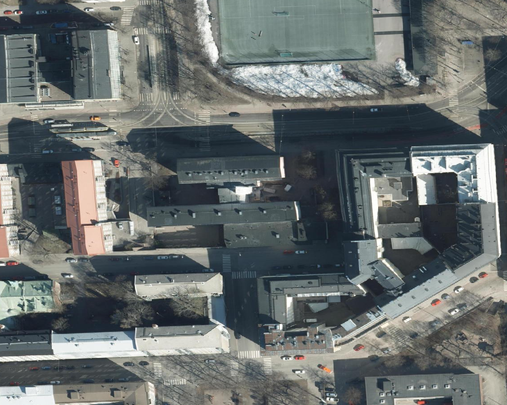
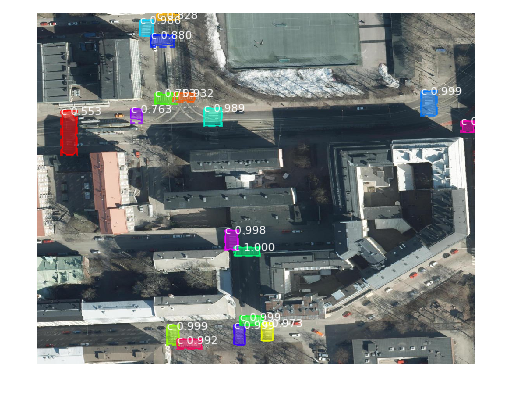
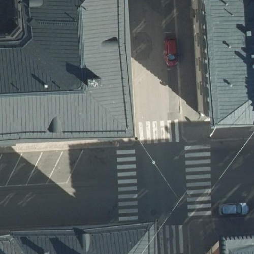
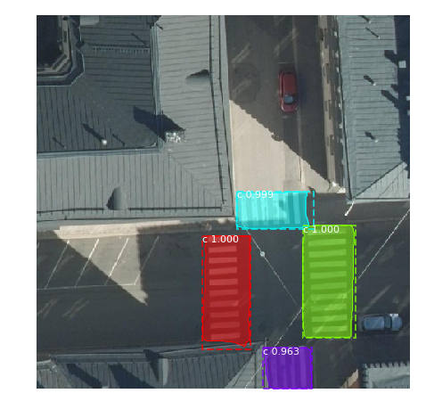

# Hesinki pedestrian crossing detection

This repo consists of research work done on **roadmarking detection** from aerial images using machine learning for city of Helsinki.

Some sample pedestrian crossing detection result from Mask R-CNN model 

